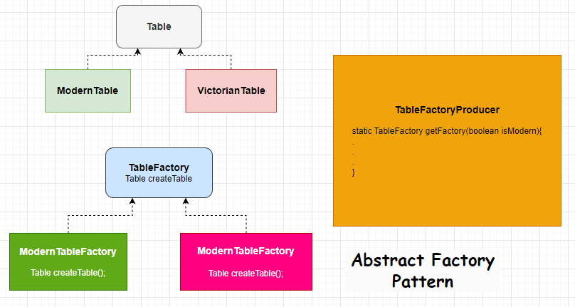

# Abstract Factory Pattern

 

    public interface Table {
    }
    
    public class ModernTable implements Table {
    }

    public class VictorianTable implements Table {
    }
 

    public interface TableFactory {
        Table createTable();
    }
    public class ModernTableFactory implements TableFactory {
        @Override
        public Table createTable() {
            return new ModernTable();
        }
    }
    public class VictorianTableFactory implements TableFactory {
        @Override
        public Table createTable() {
            return new VictorianTable();
        }
    }
 

    public class TableProducer {
        public static TableFactory getFactory(boolean isModern){
            if(isModern){
                return new ModernTableFactory();
            }
            return new VictorianTableFactory();
        }
    }
 

        public static void main(String[] args) {
            Table table = TableProducer.getFactory(true).createTable();
            System.out.println(table.getClass().getSimpleName());
        }
 

**Result**\
ModernTable

# [«««](https://github.com/MedetHasanUgurlu/Design-Patterns)

