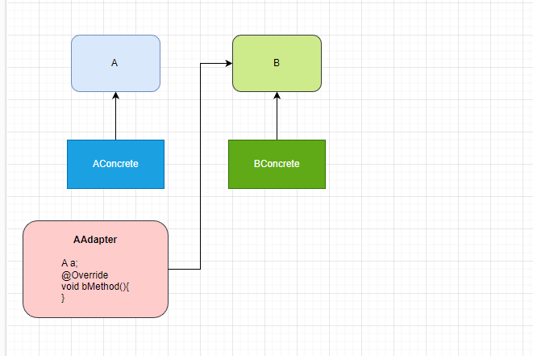

# Adapter Pattern
"The Sith Control Everything, You Just Don't Know It."  
****

### Recipes
1) Write adapter class which you want to adapt to another class.
2) Implements to target interface.
3) Inject the own interface.
4) Change to which desired methods.

****

    public interface A {
    void aMethod();
    void aMethod2();
    }

****
    public class AConcretes implements A{
    @Override
    public void aMethod() {
    System.out.println("A method 1");
    }

    @Override
    public void aMethod2() {
        System.out.println("A method 2");
    }}
****

    public interface B {
    void bMethod();
    void bMethod2();
    }

****
    public class BConcretes implements B{
    @Override
    public void bMethod() {
    System.out.println("B method 1");
    }

    @Override
    public void bMethod2() {
        System.out.println("B method 2");
    }}
*****
    public class AAdapter implements B{
    A a;

    public AAdapter(A a) {
        this.a = a;
    }

    @Override
    public void bFeatures() {
        System.out.println("Nothing");
    }

    @Override
    public void bbbFeatures() {
        a.aaaFeatures();
    }}
******
    public static void main(String[] args) {
        AConcretes aConcretes = new AConcretes();
        aConcretes.aaaFeatures();
        BConcretes bConcretes = new BConcretes();
        bConcretes.bbbFeatures();
        AAdapter aAdapter = new AAdapter(aConcretes);
        aAdapter.bbbFeatures();
    }

# [«««](https://github.com/MedetHasanUgurlu/Design-Patterns)

