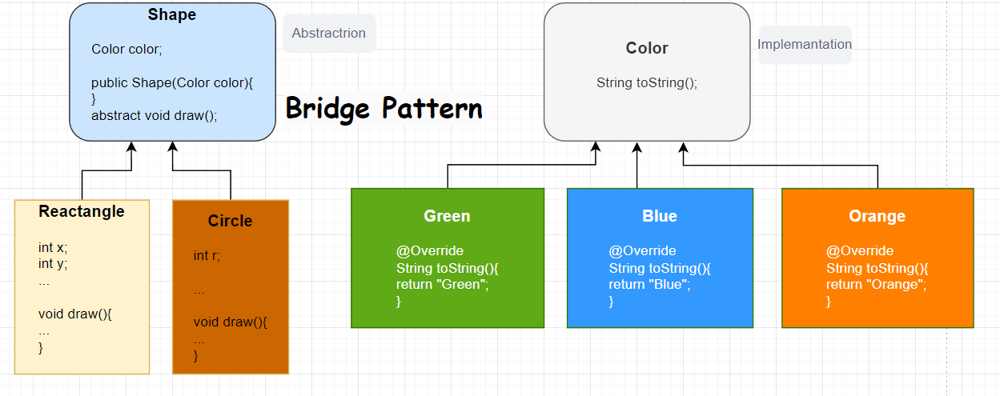

# Bridge Pattern
“My cabbages!!” \
The Cabbage Merchant
 

 
Abstraction
 

    public abstract class Shape {
        protected Color color;
        public Shape(Color color){
            this.color = color;
        }
        abstract void draw();
    }
 

    @Getter
    @Setter
    public class Rectangle extends Shape{

        private int x;
        private int y;
        public Rectangle(int x, int y, Color color) {
            super(color);
            this.x = x;
            this.y = y;
        }

        @Override
        void draw() {
            System.out.println("Rectangle- "+ color.toString()+"Length:"+x+"-"+y);
        }
    }

 
Implementation
 

    public interface Color {
        String toString();
    }

    public class Blue implements Color{
        @Override
        public String toString() {
            return "Blue";
        }
    }

    public class Orange implements Color{
        @Override
        public String toString() {
            return "Orange";
        }
    }
 
Main
 
        
        public class Main {
            public static void main(String[] args) {
                Rectangle rectangle = new Rectangle(6,8,new Orange());
                rectangle.draw();
            }
        }
#### Result
Rectangle- Orange Length-6-8

## [«««▓](https://github.com/MedetHasanUgurlu/Design-Patterns)
