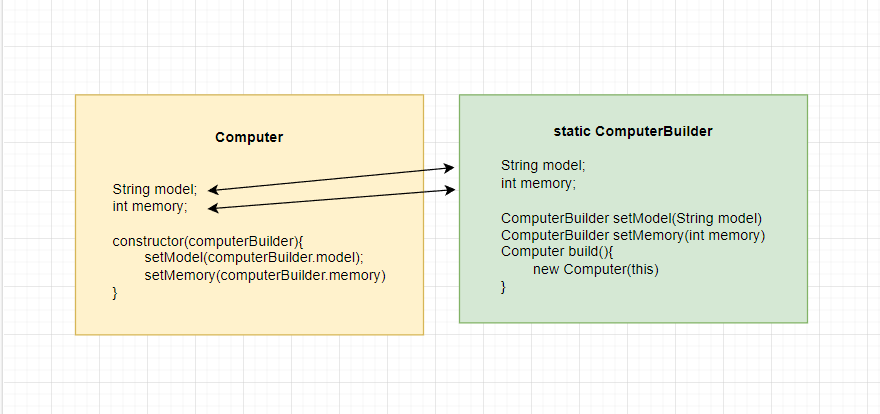

# Builder Pattern

### Recipe
1) Make private constructor and inject the static class which builder.
2) In static builder class, you set the value then return the static class.
3) Finally, write build method which takes static class and returns the new Entity.

 

    @Getter
    @Setter
    public class Computer {
        private String brand;
        private String model;
        private int year;
        private int memory;

        private Computer(ComputerBuilder builder) {
            this.brand = builder.brand;
            this.model = builder.model;
            this.year = builder.year;
            this.memory = builder.memory;
        }
    
        public static class ComputerBuilder{
            private String brand;
            private String model;
            private int year;
            private int memory;

            public ComputerBuilder setBrand(String brand){
                this.brand = brand;
                return this;
            }
            public ComputerBuilder setModel(String model){
                this.model = model;
                return this;
            }
            public ComputerBuilder setYear(int year){
                this.year = year;
                return this;
            }
            public ComputerBuilder setMemory(int memory){
                this.memory = memory;
                return this;
            }
            public Computer build(){
                return new Computer(this);
            }
        }

        @Override
        public String toString() {
            return "Computer{" +
                    "brand='" + brand + '\'' +
                    ", model='" + model + '\'' +
                    ", year=" + year +
                    ", memory=" + memory +
                    '}';
        }
    }   
 

**Result**
    
    public static void main(String[] args) {
        Computer computer = new Computer.ComputerBuilder()
            .setBrand("MSI")
            .setModel("RTX-3060")
            .setYear(2020)
            .setMemory(32)
            .build();
        System.out.println(computer.toString());
    }
_**Computer{brand='MSI', model='RTX-3060', year=2020, memory=32}**_

## [«««Home«««](https://github.com/MedetHasanUgurlu/Design-Patterns)
