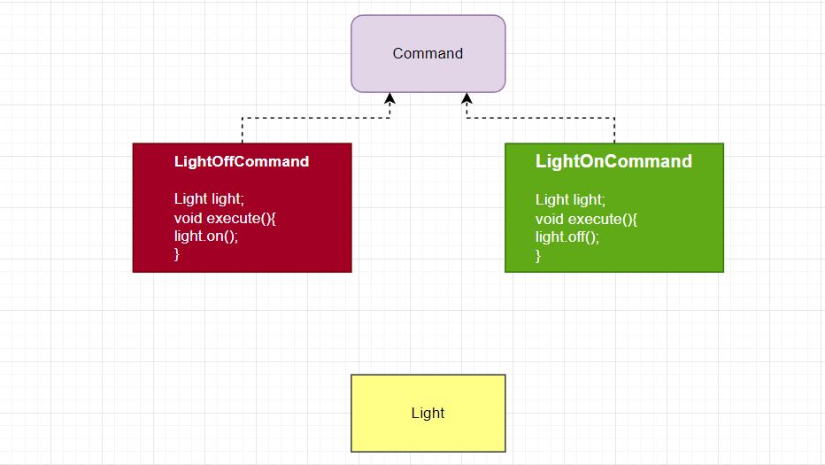
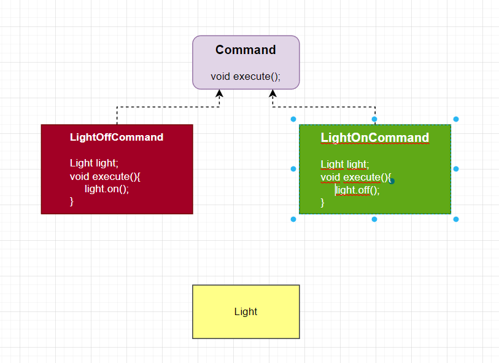

# Command Pattern
>“There is always something more to learn. Even for a master.”
> 
> Master Oogway

*****
1) First generate Command Interface.
2) Write commands which implements Command interface.
3) Then, write controller which takes Command argument then execute command.
******
    public interface Command {
    void execute();
    }
****
    public class LightOnCommand implements Command{
    Light light;

    public LightOnCommand(Light light) {
        this.light = light;
    }
    @Override
    public void execute() {
        System.out.println("Sensitivity: "+ light.getSensitivity()+ ", Color: "+ light.getColor()+ " is on.");
    }}
****
    public class RemoteController {
    Command command;

    public RemoteController() {
    }

    public void setCommand(Command command) {
        this.command = command;
    }
    public void buttonWasPressed(){
        command.execute();
    }}

****

# [«««](https://github.com/MedetHasanUgurlu/Design-Patterns)
