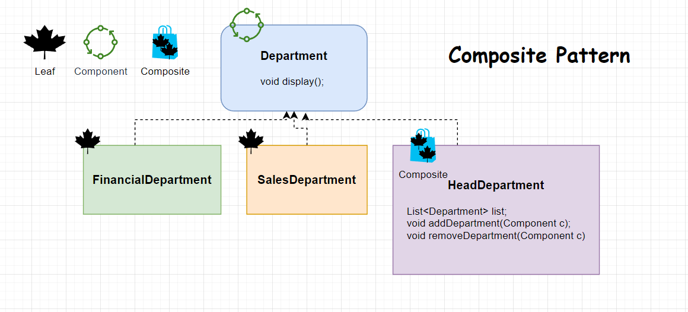

# Composite Pattern
* Composite pattern, when we put the objects in a single object.  
* Composite pattern composes objects in terms of a _tree structure_ to represent part as well as whole hierarchy.
* **This pattern creates a class that contains a group of its own objects**. 

### Recipe
1) We need to base class it should be an interface or abstract.
2) Write leaves which implement the base class
3) Compose the object in a one single object.

***
 

* component – is the base interface for all the objects in the composition. 
It should be either an **interface or an abstract class** with the common methods to manage the child composites.

 

    public interface Department {
        void showInfo();
    }

 

leaf – implements the default behavior of the base component. 
    It doesn't contain a reference to the other objects.

 

    public class FinancialDepartment implements Department{
        private int id;
        private String name;

        public FinancialDepartment(int id, String name) {
            this.id = id;
            this.name = name;
        }

        @Override
        public void showInfo() {
            System.out.println("Id: "+id+ "Name: "+name);
        }

 

    public class SalesDepartment implements Department {
            private int id;
            private String name;

        public SalesDepartment(int id, String name) {
            this.id = id;
            this.name = name;
        }
        @Override
        public void showInfo() {
            System.out.println("Id: "+id+ "Name: "+name);
        }
    }
 

* composite – has leaf elements. It implements the base component methods and defines the child-related operations.
     

    public class HeadDepartment implements Department{
        Logger logger = Logger.getLogger("HeadDepartment.class.getName()");
        private int id;
        private String name;
        List<Department> departments;

        public HeadDepartment(int id, String name) {
            this.id = id;
            this.name = name;
            departments = new ArrayList<>();
        }

        @Override
        public void showInfo() {
            System.out.println("Id: "+id+ "Name: "+name);
            departments.forEach(Department::showInfo);
        }

        public void addDepartment(Department department){
            departments.add(department);
        }

        public void removeDepartment(Department department){
            departments.remove(department);
        }    
    }

## [«««Go Back«««](https://github.com/MedetHasanUgurlu/Design-Patterns)