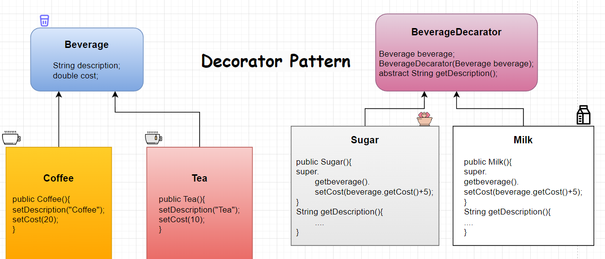

# Decorator Pattern
Just adding sugar to Tea, that's all. Inject feature

 

    @Getter
    @Setter
    public abstract class Beverage {
        private String description;
        private double cost=0;
        public abstract double calculateCost();
    }
 

    @Getter
    @Setter
    public class Coffee extends Beverage{
        public Coffee(){
            super.setCost(20);
            super.setDescription("Coffee");
        }
        @Override
        public double calculateCost() {
            return 20;
        }
    }

 

    @Getter
    @Setter
    public abstract class BeverageDecorator {
        private Beverage beverage;

        public BeverageDecorator(Beverage beverage) {
            this.beverage = beverage;
        }
        public abstract String getDescription();
    }
 

    public class Milk extends BeverageDecorator{
        public Milk(Beverage beverage) {
            super(beverage);
            super.getBeverage().setCost(beverage.getCost()+5);
        }

        @Override
        public String getDescription() {
            return super.getBeverage().getDescription()+" ,Milk";
        }

    }

# [«««](https://github.com/MedetHasanUgurlu/Design-Patterns)
