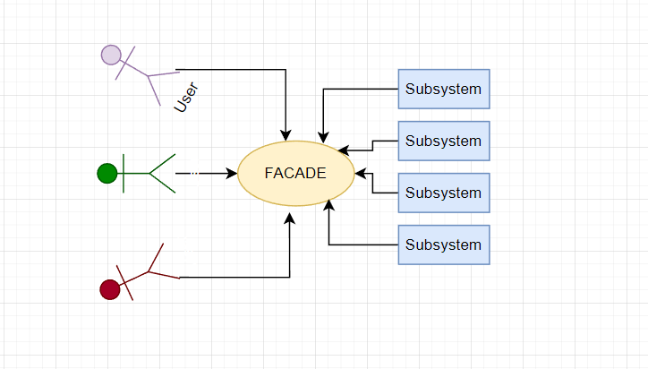

# Facade Pattern

***
#### Recipe
1) Subsystem should be connected to Facade.
2) Facade does not affect the behaviour of subsystem.
3) Facade only use it
***
**_Facade_**

    public class Computer {
    private String cpuName;
    private String gpuName;
    private final Cpu cpu;
    private  final Gpu gpu;

    public Computer(String cpuName, String gpuName){
        cpu = new Cpu(cpuName);
        gpu = new Gpu(gpuName);
        this.gpuName = gpuName;
        this.cpuName = cpuName;
    }
    public void pressStart(){
        cpu.launch();
        gpu.launch();
    }
    public void pressStop(){
        gpu.terminate();
        cpu.terminate();
    }
}    
***
**_SubSystem_**

    @AllArgsConstructor
    public class Cpu {
        private String name;

        public void launch(){
            System.out.println(String.format("%s is launched.",name));
        }
        public void terminate(){
            System.out.println(String.format("%s is terminated.",name));
        }
    }

***
**_SubSystem_**

    @AllArgsConstructor
    public class Gpu {
        private String name;

        public void launch(){
            System.out.println(String.format("%s is launched.",name));
        }
        public void terminate(){
            System.out.println(String.format("%s is terminated.",name));
        }   
    }
***
**_SubSystem_**

    public static void main(String[] args) {
        Computer computer = new Computer("Ryzen-3","RTX 3060");
        computer.pressStart();
    }
**Result**\
Ryzen-3 is launched.\
RTX 3060 is launched.
