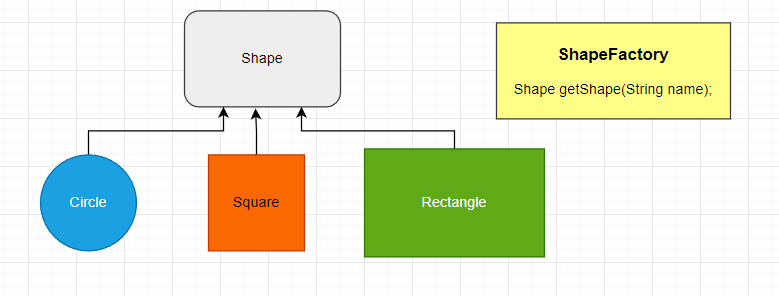

# Factory Pattern

 

    public interface Shape {
        void info();
    }
 

    public class Circle implements Shape{
        @Override
        public void info() {
            System.out.println("Circle...");
        }
    }
   

    public class Square implements Shape{
        @Override
        public void info() {
            System.out.println("Square");
        }
    }

     
Using Enum

    public enum ShapeFactoryV2 {
    Circle{
        @Override
        public Shape createShape() {
            return new Circle();
        }

    },
    Square{
        @Override
        public Shape createShape() {
            return new Square();
        }
    };
    public abstract Shape createShape();
    }

 

    public static void main(String[] args) {
        Shape s = ShapeFactoryV2.Circle.createShape();
        s.info();
    }

# [«««](https://github.com/MedetHasanUgurlu/Design-Patterns)

