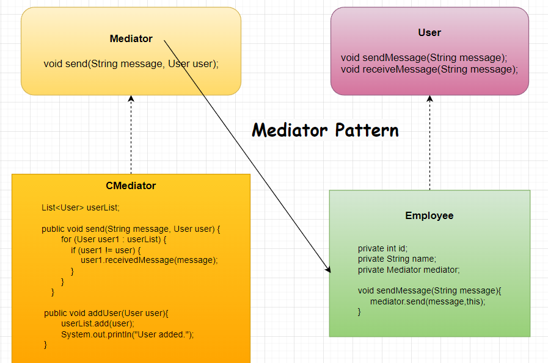

# Mediator Pattern

 

    public interface User {
        void sendMessage(String message);
        void receivedMessage(String message);
    }
 

    @Getter
    @Setter
    @Builder
    @AllArgsConstructor
    @NoArgsConstructor
    public class Employee implements User{

        private int id;
        private String name;
        private Mediator mediator;
        @Override
        public void sendMessage(String message) {
            System.out.println("Id: "+id+ " Name: "+name+ " sending message."+"["+message+"]");
            mediator.send(message,this);
        }
    
        @Override
        public void receivedMessage(String message) {
            System.out.println("Id: "+id+ " Name: "+name+ " received message."+"["+message+"]");
        }
    }
 

    public interface Mediator {
        void send(String message,User user);
    }
 

    public class CMediator implements Mediator{
        List<User> userList;
        public CMediator(){
            userList = new ArrayList<>();
        }

        @Override
        public void send(String message, User user) {
            for (User user1 : userList) {
                if (user1 != user) {
                    user1.receivedMessage(message);
                }
            }
        }

        public void addUser(User user){
            userList.add(user);
            System.out.println("User added.");
        }
    }
 

# [«««](https://github.com/MedetHasanUgurlu/Design-Patterns)