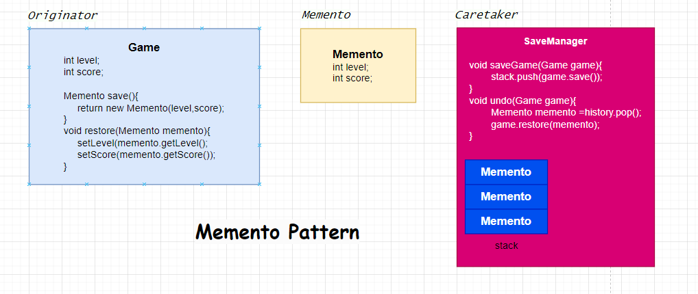

# Memento Pattern
 
**Originator**, durumu saklanacak olan nesnedir.\
**Memento**, nesnenin geçmiş durumunu temsil eder.\
**Caretaker** ise Memento'ları yönetir.\

 
### Recipe

1) First write the object and also object class must be included save method which returns the Memento
2) Memento only has object field.
3) Caretaker stores the moment when we save the game it pushes the stack or pops.

 
Originator

    @AllArgsConstructor
    @NoArgsConstructor
    @Getter
    @Setter
    public class Game {
        private int level;
        private int score;

        public Memento save(){
            return new Memento(level,score);
        }
        public void restore(Memento memento){
            level = memento.getLevel();
            score = memento.getScore();
        }
    }
 
Memento

    @AllArgsConstructor
    @NoArgsConstructor
    @Getter
    @Setter
    public class Memento {
        private int level;
        private int score;

        @Override
        public String toString() {
            return "Memento{" +
                    "level=" + level +
                    ", score=" + score +
                    '}';
        }
    }
 
Caretaker

    @AllArgsConstructor
    @NoArgsConstructor
    @Getter
    @Setter
    public class SaveManager {
        private Stack<Memento> history = new Stack<>();
        public void save(Game game){
            history.push(game.save());
        }
        public void undo(Game game){
            Memento memento = history.pop();
            game.restore(memento);
        }
    }
    

# [«««Home](https://github.com/MedetHasanUgurlu/Design-Patterns)