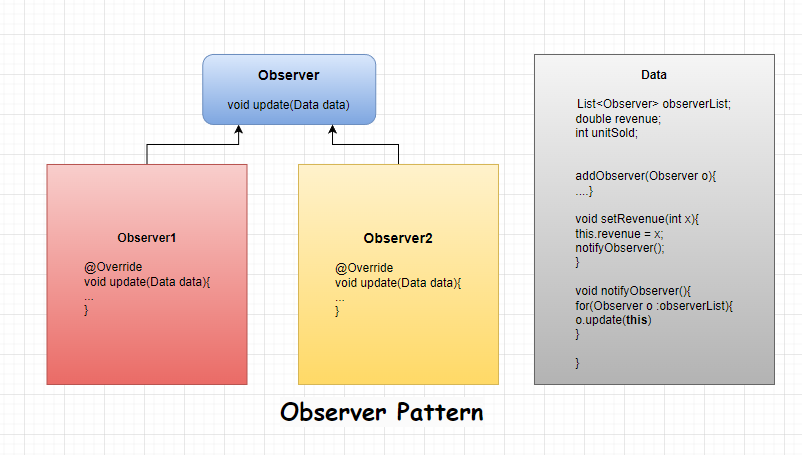

# Observer Pattern

* Subject

    @Getter
    @Setter
    @AllArgsConstructor
    @Builder
    public class SalesData {
        private double revenue;
        private int unitsSold;
        private List<Observer> observerList;

        public SalesData(){
            observerList = new ArrayList<>();
        }
        public void setRevenue(double revenue) {
            this.revenue = revenue;
            notifyObserver();
        }
    
        public void setUnitsSold(int unitsSold) {
            this.unitsSold = unitsSold;
            notifyObserver();
    
        }
        public void notifyObserver(){
            for (Observer observer : observerList) {
                observer.update(this);
            }
        }
        public void attachObserver(Observer observer){
            observerList.add(observer);
        }
    }

* Observer

    public abstract class Observer {
        abstract void update(SalesData data);
    }

* Observer Concretes

    public class SalesReportScreen extends Observer{
        @Override
        void update(SalesData data) {
            System.out.println("SalesReportScreen - Units sold: " + data.getUnitsSold() + ", Revenue: " + data.getRevenue());
        }
    }

 

    public class SalesReportScreen2 extends Observer {
        @Override
        void update(SalesData data) {
            System.out.println("SalesReportScreen2 - Units sold: " + data.getUnitsSold() + ", Revenue: " + data.getRevenue());
        }
    }

* Main

    
    public class Main {
        public static void main(String[] args) {
            Observer observer = new SalesReportScreen();
            Observer observer1 = new SalesReportScreen2();
            SalesData data = new SalesData();
            data.attachObserver(observer);
            data.attachObserver(observer1);
            data.setRevenue(1500);
            data.setUnitsSold(150);
            data.setRevenue(15200);
            data.setUnitsSold(500);
        }
    }
# [«««](https://github.com/MedetHasanUgurlu/Design-Patterns)