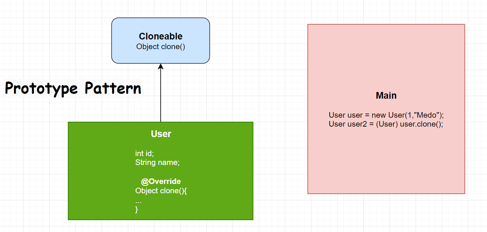

# Prototype Pattern

> "500 years in the spirit realm, you pick up a thing or two" \
_**Kai**_

 

#### Recipe
└┴┬ Only implements the Cloneable interface, that's all. 

    @Getter
    @Setter
    @AllArgsConstructor
    public class User implements Cloneable{
        private int id;
        private String name;

        @Override
        protected Object clone() {
            try {
                return super.clone();
            } catch (CloneNotSupportedException e) {
                throw new RuntimeException(e);
            }
        }
    }
 

    public class Main {
        public static void main(String[] args) {
            User user = new User(1,"Medo");
            User user2 =(User) user.clone();
            System.out.println(user2.getId()+" "+ user2.getName());
        }
    }

### Result
1 Medo
# [«««](https://github.com/MedetHasanUgurlu/Design-Patterns)