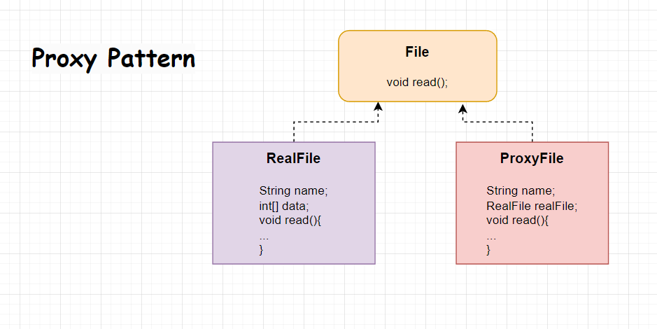

# Proxy Pattern

#### Main Idea
1) Proxy Class takes the place which real concrete class.
2) We easily configure the real class in proxy class. 

 

Gerçek dosya nesnesi arayüzü

    interface Dosya {
        void oku();
    }
 

Gerçek dosya sınıfı

    class GercekDosya implements Dosya {
        private String dosyaAdi;

        public GercekDosya(String dosyaAdi) {
            this.dosyaAdi = dosyaAdi;
            yukle();
        }

        private void yukle() {
            System.out.println("Dosya yükleniyor: " + dosyaAdi);
        }

        public void oku() {
            System.out.println("Dosya okunuyor: " + dosyaAdi);
        }
    }
 

Proxy dosya sınıfı

    class ProxyDosya implements Dosya {
        private String dosyaAdi;
        private GercekDosya gercekDosya;

        public ProxyDosya(String dosyaAdi) {
            this.dosyaAdi = dosyaAdi;
        }

        public void oku() {
            if (gercekDosya == null) {
                gercekDosya = new GercekDosya(dosyaAdi);
            }
            System.out.println("Dosya okunuyor: " + dosyaAdi);
        }
    }
 

**Result**

    Dosya dosya = new ProxyDosya("ornek_dosya.txt");
    dosya.oku(); // dosya yükleniyor ve okunuyor
    dosya.oku(); // sadece dosya okunuyor (yükleme işlemi tekrar yapılmıyor)

# [«««](https://github.com/MedetHasanUgurlu/Design-Patterns)