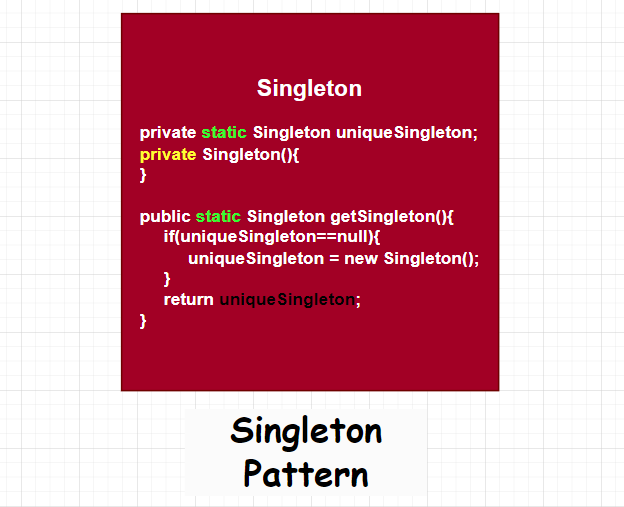

# Singleton Pattern

The Singleton Pattern ensures a class has only one
instance, and provides a global point of access to it.
### Pattern Diagram

# [«««](https://github.com/MedetHasanUgurlu/Design-Patterns)