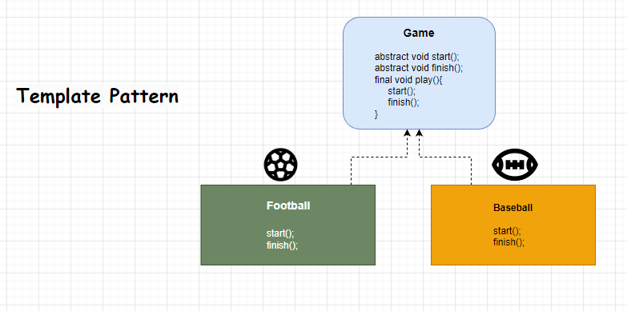

# Template Pattern
#### Easy Come Easy Go

***
### Recipe
1) Call the methods which its has owned.
***
    public abstract class Game {
    
        public abstract void initialize();
        public abstract void start();
        public abstract void finish();

        public final void launch(){
            initialize();
            start();
            finish();
        }
    }
***